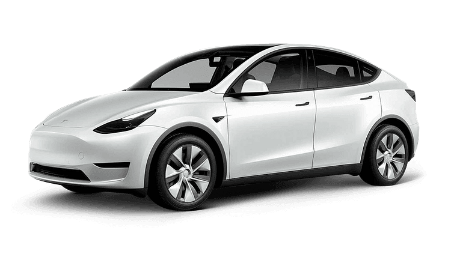
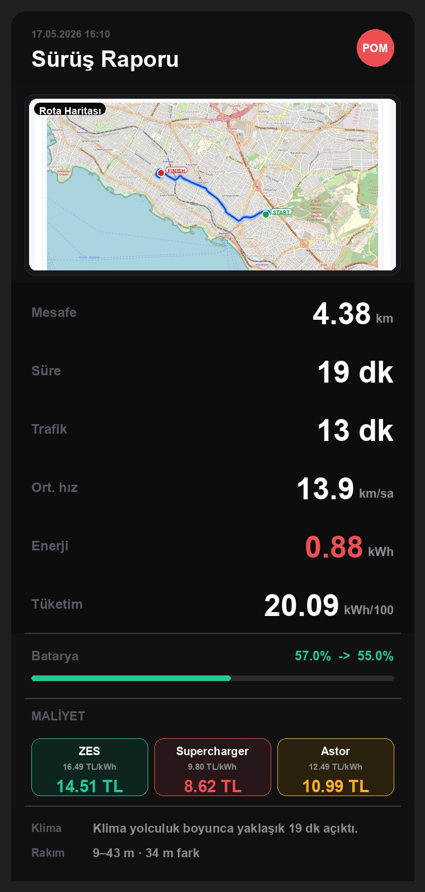
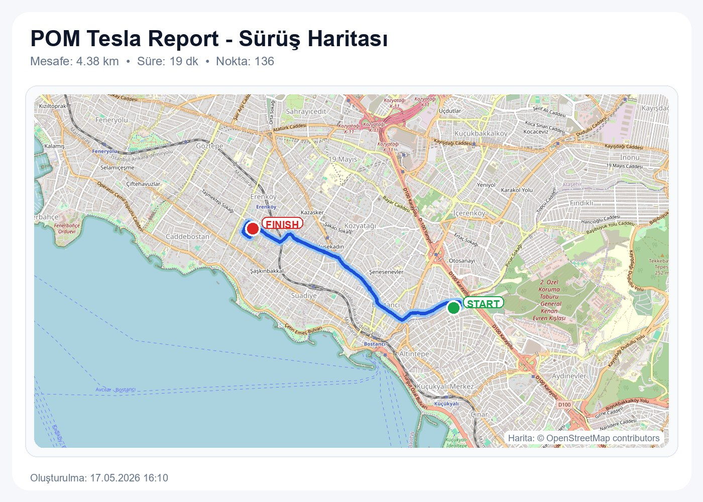
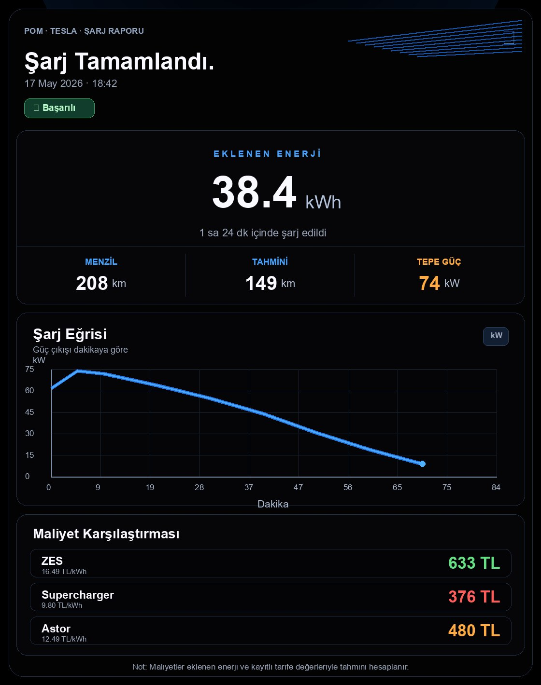

# POM Tesla AI

<!-- AUTO:BADGES_START -->
Version: 2.1.1-beta.1 | Last updated: 2026-05-18
<!-- AUTO:BADGES_END -->

<p align="center">
  
</p>

Turn your Tesla into an AI-powered assistant. Through Home Assistant and Telegram, you get a companion that can chat with you, explain vehicle details, and provide access to driving-related controls. It is more than chat: it can also send trip and charging reports to Telegram manually or automatically. The integration also includes a live driving card so you can monitor key trip data during a drive. Instead of handing over your Tesla account directly, you can authorize specific users for driving workflows through Tesla AI.

> Beta status: this integration can send real commands to your vehicle. Start with read-only status questions, then test safe commands, and only enable risky controls when you understand the confirmation flow.

## What It Does

POM Tesla AI is a custom Home Assistant integration built around a Tesla-focused AI assistant. It combines vehicle telemetry, Telegram conversation, curated vehicle-control capabilities, trip reports, charging reports, and route maps.

Main features:

- AI-powered Telegram assistant for natural Turkish vehicle conversations
- Capability-based vehicle control router
- Telegram confirmation buttons and text confirmations
- Manual entity selection for report data and AI context
- Drive/trip PNG reports
- Charging session summaries
- Optional route map collection and separate map image sending
- Vehicle Entity Manager for report, AI, map, and alert usage
- AI alerts and watcher-style notifications
- Test/simulation tools for trip report validation

## Installation

### Manual Installation

1. Download or clone this repository.
2. Copy this folder:

```text
custom_components/pom_tesla_report
```

to your Home Assistant config folder:

```text
/config/custom_components/pom_tesla_report
```

3. Restart Home Assistant.
4. Go to Settings > Devices & services.
5. Add integration: `POM Tesla Report`.

### HACS Custom Repository

This beta can also be added as a HACS custom repository:

1. HACS > Integrations > three-dot menu > Custom repositories
2. Repository:

```text
https://github.com/berkansezer77/pom_tesla_report
```

3. Category: Integration
4. Download `POM Tesla Report`
5. Restart Home Assistant

### Lovelace Resource Setup (Beta)

If the dashboard card does not appear automatically, add the card resource manually:

1. Home Assistant > Settings > Dashboards > three-dot menu > Resources
2. Add resource URL:

```text
/local/community/pom_tesla_report/pom-tesla-dashboard-card.js
```

3. Resource type: `JavaScript Module`
4. Save and reload the dashboard

## First Setup

POM Tesla Report intentionally ships without your personal entity IDs. A new user must select entities manually.

At minimum, configure:

- Battery level sensor
- Speed sensor
- Odometer sensor
- Shift state sensor
- Climate entity
- Charging status entity
- Charge energy added sensor
- Location tracker for maps, if you want trip maps
- Telegram target, if you want Telegram messages
- OpenAI API key, if you want AI chat and AI control routing

## Vehicle Entity Manager

The Vehicle Entity Manager is the central place where you tell POM what each entity is allowed to do.

Each entity can be marked for one or more uses:

- Report: used in trip and charging reports
- AI: included in AI context
- Map: used for route tracking
- Alerts: used by AI alert/watch logic

This separation is important. A sensor can be useful for reports but not for AI, or useful for AI but not for maps.

## AI Telegram Assistant

The Telegram listener no longer requires a prefix. You can write directly:

```text
sentry acik mi?
arac uyanik mi?
sarj oluyor mu?
cok sicak
klimayi ac
```

If you still write `POM klimayi ac`, it is accepted as a legacy style, but it is not required.

## Vehicle Controls and Confirmations

POM uses a curated capability manifest instead of guessing entity IDs. The AI chooses a capability, and the code maps that capability to your selected entity.

Examples:

```text
sentry mode ac
klimayi kapat
korna cal
camlari kapat
bagaji ac
```

Risky actions can require confirmation. Telegram confirmation supports both:

- Inline buttons: Onayla / Iptal
- Text replies: evet, tamam, onayliyorum, onay veriyorum, iptal

If there is no real pending action and you write `onayliyorum`, POM will not pretend to execute anything. It will tell you that there is no pending vehicle-control approval.

## Trip Reports

Trip reports are generated from the report entities you selected. The integration does not include any personal report history.

Typical report inputs:

- Start and end odometer
- Battery level
- Energy remaining
- Speed / shift state
- Climate state
- Route points, when trip map collection is enabled

Example output image:



## Trip Maps

Trip map collection is optional.

Settings:

- Enable trip map collection
- Trip map tracker entity
- Map sample interval seconds
- Minimum movement meters
- Send separate trip map PNG

If `Send separate trip map PNG` is disabled, POM will not send the map as a second Telegram image after the trip report.

Example output image:



## Charging Reports

Charging reports can summarize sessions with:

- Added energy
- Duration
- Provider pricing
- Estimated or manually confirmed cost
- Telegram prompt flow for real charging cost

Example output image:



## AI Alerts

AI alerts can watch selected entities and notify you about important vehicle states such as:

- Low battery
- Charging stopped
- Tire pressure concerns
- High battery temperature
- Unlocked vehicle
- Door/window open conditions

## Test and Simulation Tools

The integration includes test/simulation tools for validating trip/report behavior without needing to drive the car every time.

These tools are useful for beta testing and development. Normal users do not need them during daily use.

## Recommended Data Source

For best results, use this integration together with either Tessie or TeslaMate.

At least one of these data providers is required. Their telemetry and control entities are what power the AI assistant, reporting pipeline, and vehicle-control workflows.

## Privacy and Safety

This repository does not include:

- Personal Telegram chat IDs
- Personal Home Assistant entity IDs
- API keys
- Generated report PNG files
- Route history
- Vehicle logs

You must configure your own entities and credentials after installation.

## Beta Notes

This is a beta release. Before relying on vehicle controls:

1. Test read-only questions first.
2. Test non-risky commands.
3. Test confirmation flow.
4. Confirm that the Vehicle Entity Manager maps the right entity to each capability.
5. Keep optional confirmation enabled if you want a more cautious setup.

## License

MIT
