# Tesla AI

**Tesla AI** is a Home Assistant custom integration and dashboard package for Tesla owners who want a richer in-car dashboard, live trip tracking, visual trip reports, charge reports, Telegram notifications, and AI-powered driving insights.

It brings together a Tesla-style dashboard, a dedicated in-car Drive Dashboard, Live Trip monitoring, Telegram reporting, OpenAI-powered driving comments, charge/session tracking, entity mapping tools, and record management inside one Home Assistant experience.

> **Disclaimer:** Tesla AI is an independent Home Assistant custom integration. It is not affiliated with, endorsed by, or sponsored by Tesla, Inc.

---
## Key Features

- Tesla-style Home Assistant dashboard
- Dedicated Drive Dashboard for Tesla browser use
- Live Trip tracking with distance, speed, traffic, energy, climate and elevation data
- Live Trip AI comments with configurable 1 km / 5 km / 10 km intervals
- Large AI comment reader popup for easier viewing when safe
- Visual Telegram trip reports
- Visual charge reports with charging curve and cost comparison
- Trip Records and Charge Records
- Monthly trip summaries
- Route map reports
- Built-in Telegram bot support
- Optional OpenAI-powered driving comments and AI trip stories
- Entity mapping and Auto Find tools
- Dashboard rebuild tools
- Debug center and support report tools

---

## Preview

### Tesla Dashboard

A full-screen Tesla-style dashboard with map mode, background mode, vehicle status, range, battery, energy, location, temperature and quick-access controls.

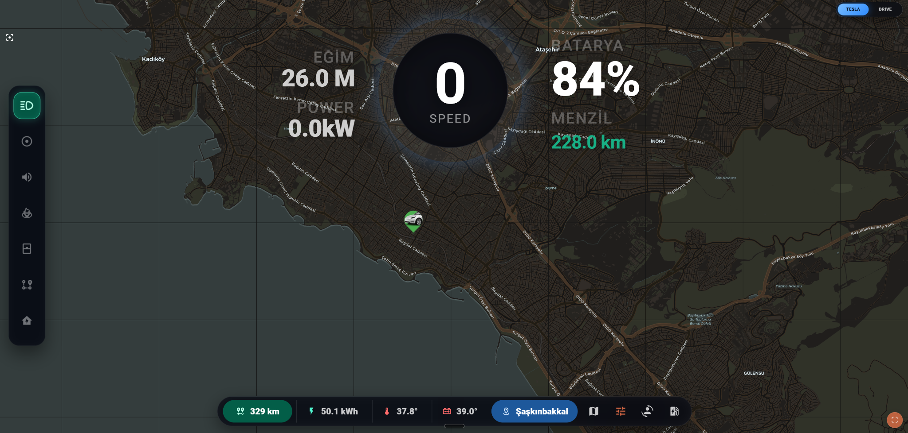

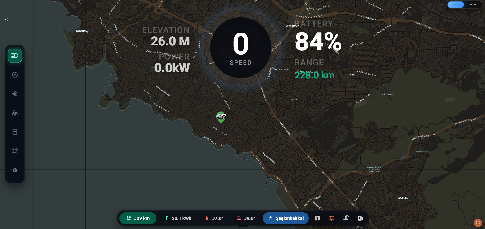

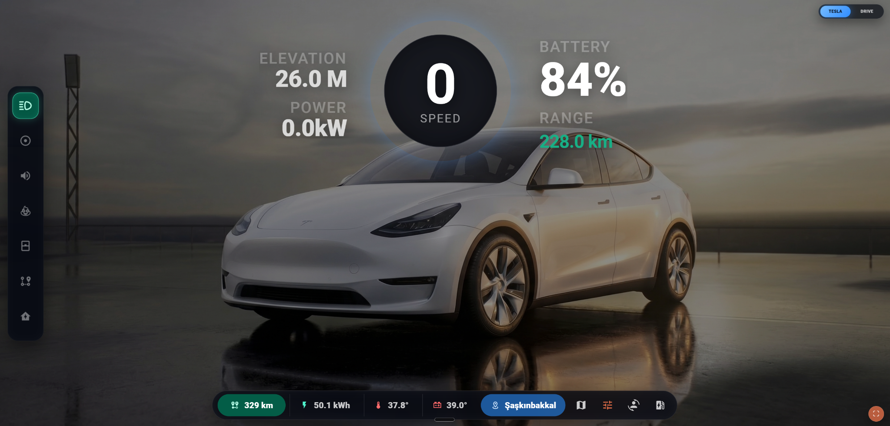

### Drive Dashboard

A simplified driving-focused screen designed for Tesla browser use. It highlights battery, speed, route, energy, climate, elevation, tire pressure, diagnostics and key bottom-bar values.

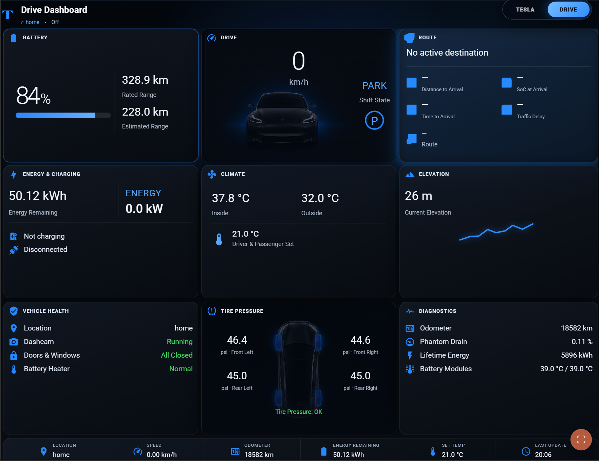

### Live Trip AI

Live Trip tracking can generate AI driving comments during a drive. The comment card can also be opened as a larger reader popup for easier viewing when safe.

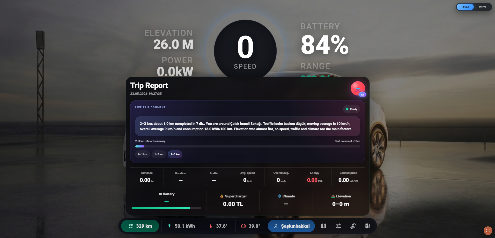

### Telegram Trip Reports

Tesla AI can generate visual trip reports with route map, distance, duration, traffic, energy, consumption, battery, cost, climate and elevation details.

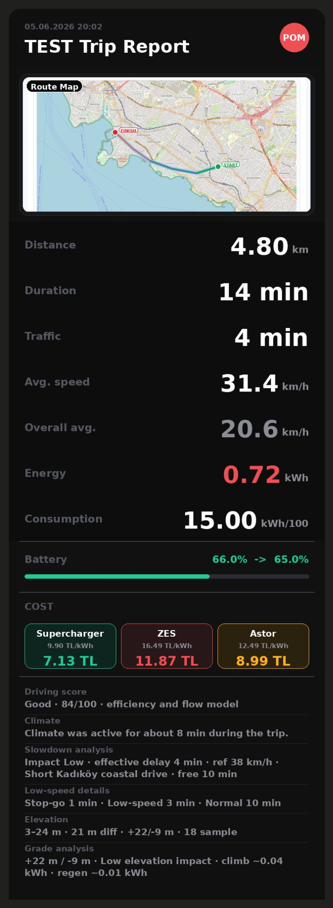

### Charge Reports

Charging sessions can be summarized with energy added, charging duration, peak power, range estimates, charging curve and cost comparison.

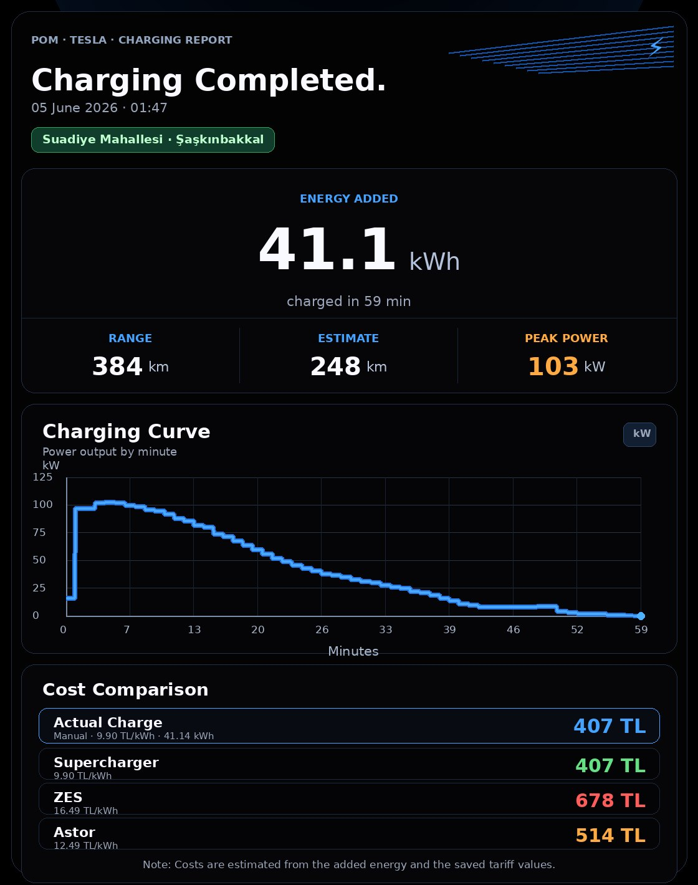

### Trip Map Report

Trip maps can show start/end points, route colorization and route metadata.

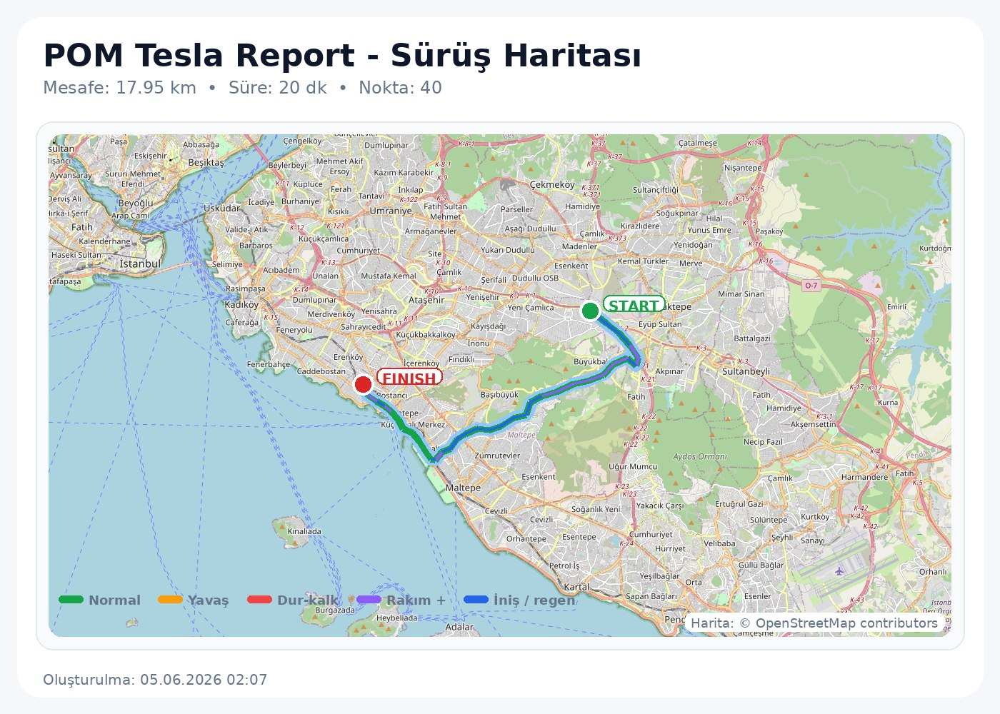

### Monthly Trip Summary

Monthly summaries can aggregate stored trip records into multi-page visual reports.

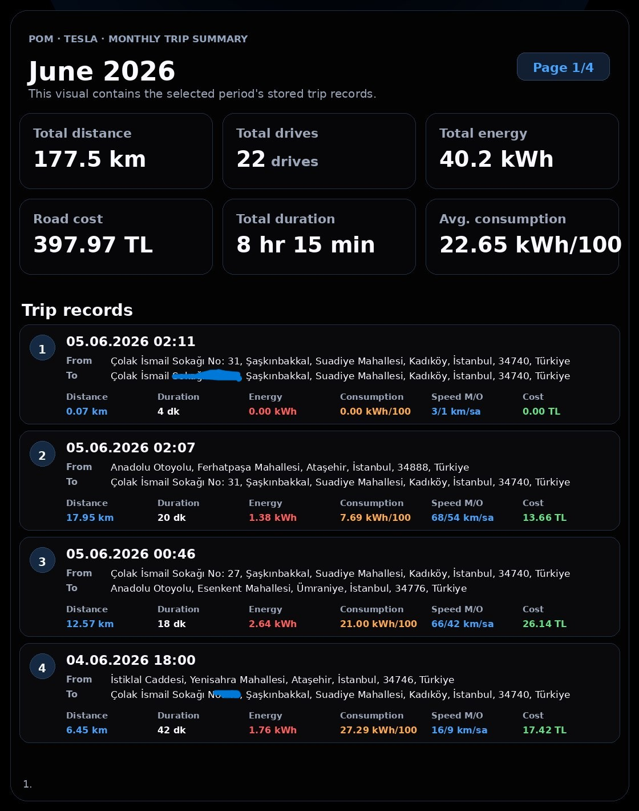

### Records Panels

Trip Records and Charge Records can be viewed, filtered and updated from the Tesla AI panel.

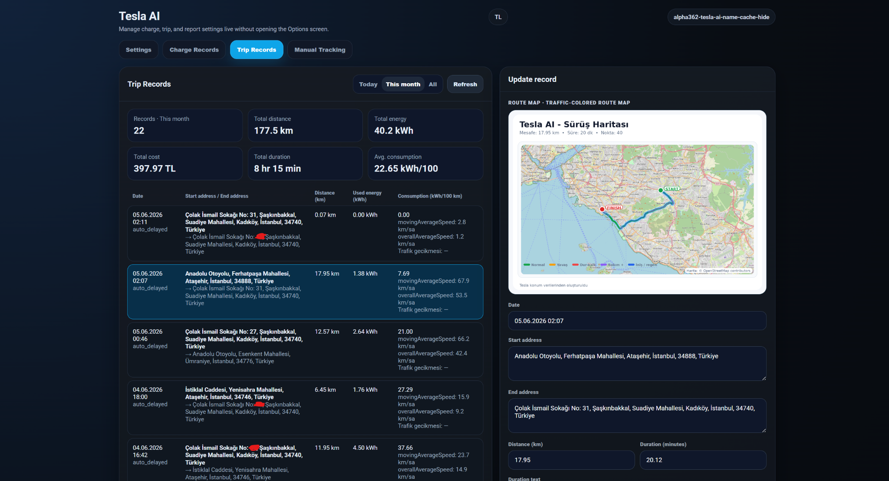

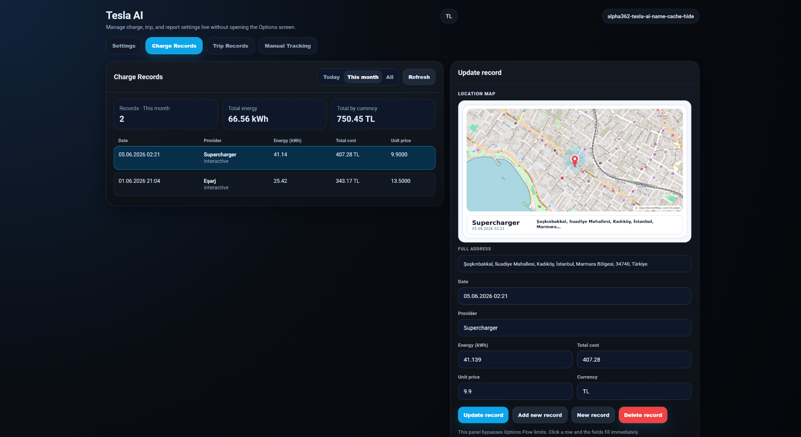

### Telegram AI Chat

The built-in Telegram bot can answer contextual questions and, when configured, handle controlled vehicle-related flows.

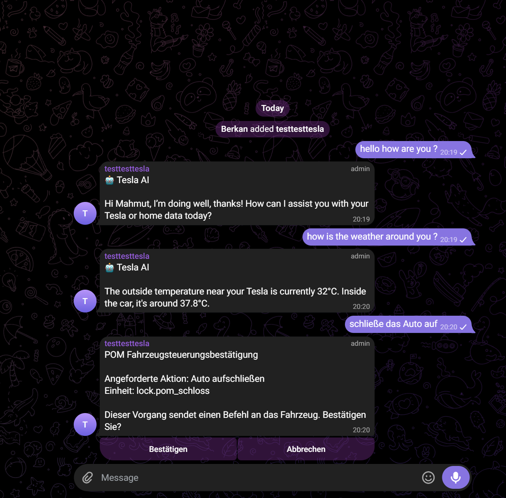

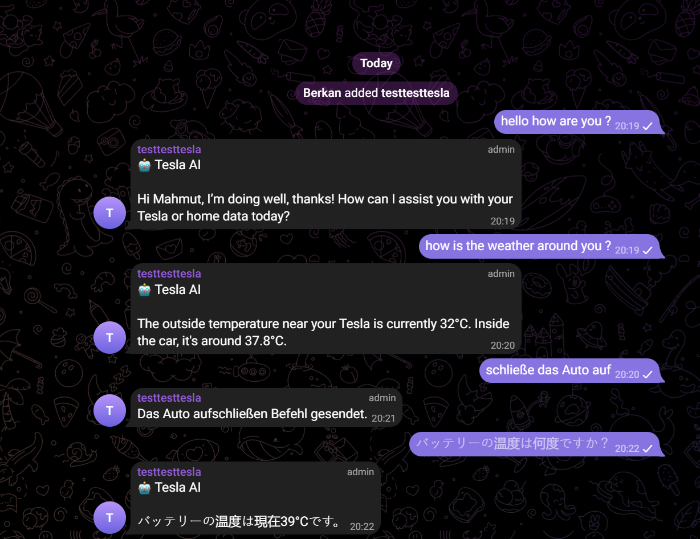

---
## Installation

Copy the integration folder into your Home Assistant installation:

```text
custom_components/pom_tesla_report
```

Then restart Home Assistant.

After restart, open **Tesla AI** from the Home Assistant sidebar and complete the first setup.

> The visible app name is **Tesla AI**, but the technical Home Assistant integration domain remains `pom_tesla_report`.

---

## First Setup Checklist

1. Open the Tesla AI panel.
2. Set language and currency.
3. Configure the required Tesla / Home Assistant entities.
4. Run entity Auto Find or manually select entities.
5. Configure Telegram if you want reports and notifications.
6. Add an OpenAI API key if you want AI comments and AI trip stories.
7. Rebuild the dashboard from the Tesla AI panel.
8. Hard-refresh your browser.

---

## Telegram

Tesla AI includes built-in Telegram bot support. Home Assistant’s separate Telegram integration is not required for the built-in Telegram workflow.

Telegram can be used for:

- Trip reports
- Charge reports
- AI driving comments
- AI chat
- Optional vehicle-related confirmation flows
- Proactive alerts

---

## OpenAI / AI Features

OpenAI support is optional. If configured, Tesla AI can generate:

- Live Trip comments
- AI trip stories
- Contextual Telegram replies
- Driving summaries
- Traffic, consumption, elevation and climate commentary

Your OpenAI API key is entered through the Tesla AI settings panel and should never be committed to GitHub.

---

## Records

Tesla AI can store and display:

- Trip Records
- Charge Records
- Route maps
- Charge location maps
- Monthly trip summaries

These records are managed from the Tesla AI panel.

---

## Important Technical Note

The integration folder and Home Assistant domain are still:

```text
pom_tesla_report
```

Do **not** rename the folder or domain unless you also migrate the Home Assistant config entry, entities, dashboard resources and internal references.

---

## Security Notes

Do not commit any of the following to GitHub:

- Home Assistant `.storage` files
- `secrets.yaml`
- Support reports that may contain private data
- Exported settings backups
- OpenAI API keys
- Telegram bot tokens
- Personal Home Assistant URLs, IPs or tokens

---

## Disclaimer

This project is an independent Home Assistant custom integration. It is not an official Tesla product and is not affiliated with Tesla, Inc.

Use all automation, notification, dashboard and AI features responsibly. Do not interact with dashboards or messages while driving unless it is safe and legal to do so.
